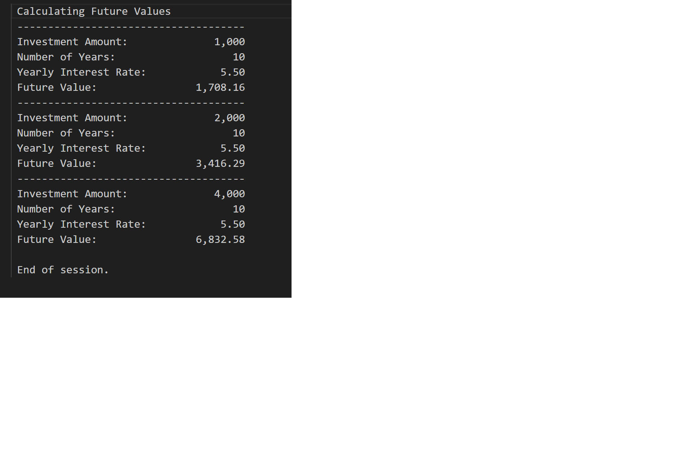

# CALC2000 (COBOL) - Future Value Calculator

<b>Table of Contents</b>
- [Summary](#-summary)
- [How It Works](#how-it-works)
- [Features](#-features)
- [Tech Stack](#-tech-stack)
- [Development Tools](#development-tools)
- [Core Concepts](#-core-concepts)
- [New Topics Covered](#new-topics-covered)
- [What I Learned](#-what-i-learned)
- [Screenshots](#-screenshots)
- [Maintainers](#-maintainers)

## 📌 Summary
### Welcome to the Future Value Calculator!
This is a simple COBOL program designed to calculate the future value of a fixed investment over a fixed number of years in a printed report 
 
For every run, the program will:
  1. Calculate the future value of the initial investment and outputs a summary report to standard output
  2. Double the initial investment, recalculate, and outputs a second report
  3. Double the investment again, recalculate, and outputs a third report

For full program details, see <a href="https://github.com/bstearns07/CALC2000/blob/main/assets/AssignmentRequirements.pdf">Program Requirements</a>

## How It Works
1. Download/copy the code from CALC2000.cbl and JCL files on your mainframe environment
2. Submit the JCL job to compile the program
3. View the system output of your submitted job to view the results

---

## ✨ Features
- 💰 Calculates **future value of investments** using compound interest  
- 🔁 Automatically runs calculations for **multiple investment scenarios**  
- 📈 Demonstrates **growth over a fixed number of years**  
- 🧾 Outputs **clean, formatted financial reports**  
- ⚡ Uses **rounded calculations** for realistic financial results  
- 🧩 Modular design with reusable procedures for scalability  

---

## 🧰 Tech Stack

- **Enterprise COBOL 6.4** – Core application logic  
- **JCL** – Compile, link, and execute (batch processing)  
- **IBM z/OS** – Mainframe runtime environment  

---

## Development Tools
- 💻 **Visual Studio Code** with **Zowe Explorer** for remote mainframe development  
- 🖥️ **IBM Mainframe (z/OS)** for compiling and execution  
- 📦 **Partitioned Datasets (PDS)** for source and program storage  

---

## 🧩 Core Concepts
- 🔢 **Arithmetic & Financial Calculations** (compound interest)
- 🔁 **Iteration with `PERFORM UNTIL` loops**
- 🧮 **COBOL Statements:** `MOVE`, `COMPUTE`, `DISPLAY`, `ADD`
- 🧾 **Data Formatting with `PIC` clauses**
- 🧱 **Structured Program Design** (modular procedure divisions)
- 📊 **Formatted Output Alignment using custom display structures**

---

## New Topics Covered
1. Developing COBOL programs for the mainframe environment
2. Variables and arithmatic
3. Loops
4. Formatted output generation
5. Division Structure
6. Comments and header documentation
7. MOVE, COMPUTE, DISPLAY, UNTIL statements
8. PICTURE statements

---

## 📘 What I Learned
This program introduced me to how COBOL can be used to perform basic arithmetic functions. Every programming language is different in regards to math syntax, so it's of course an essential skill to learn in COBOL as well. I also learned more about using the working storage section as well. Instead of using DISPLAY statement to print pieces of information bits at a time, I built a working storage item the builds the print lines for me so only 1 DISPLAY is needed to print everything.

## 🖼 Screenshots

### Output

---

## 👤 Maintainers
[@bstearns07](https://github.com/bstearns07) Ben Stearns

[Back to Top](#top)
